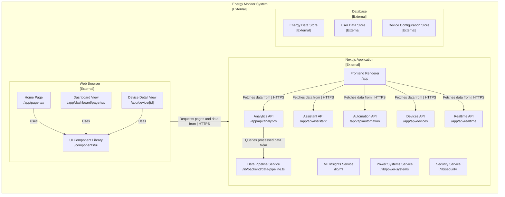

# Unnamed CodeViz Diagram

```mermaid
graph TD

    subgraph energy_monitor_system["Energy Monitor System<br>[External]"]
        subgraph web_browser_boundary["Web Browser<br>[External]"]
            home_page["Home Page<br>/app/page.tsx"]
            dashboard_view["Dashboard View<br>/app/dashboard/page.tsx"]
            device_detail_view["Device Detail View<br>/app/device/[id]"]
            ui_library["UI Component Library<br>/components/ui"]
            %% Edges at this level (grouped by source)
            home_page["Home Page<br>/app/page.tsx"] -->|"Uses"| ui_library["UI Component Library<br>/components/ui"]
            dashboard_view["Dashboard View<br>/app/dashboard/page.tsx"] -->|"Uses"| ui_library["UI Component Library<br>/components/ui"]
            device_detail_view["Device Detail View<br>/app/device/[id]"] -->|"Uses"| ui_library["UI Component Library<br>/components/ui"]
        end
        subgraph nextjs_app_boundary["Next.js Application<br>[External]"]
            frontend_renderer["Frontend Renderer<br>/app"]
            analytics_api["Analytics API<br>/app/api/analytics"]
            assistant_api["Assistant API<br>/app/api/assistant"]
            automation_api["Automation API<br>/app/api/automation"]
            devices_api["Devices API<br>/app/api/devices"]
            realtime_api["Realtime API<br>/app/api/realtime"]
            data_pipeline_service["Data Pipeline Service<br>/lib/backend/data-pipeline.ts"]
            ml_insights_service["ML Insights Service<br>/lib/ml"]
            power_systems_service["Power Systems Service<br>/lib/power-systems"]
            security_service["Security Service<br>/lib/security"]
            %% Edges at this level (grouped by source)
            frontend_renderer["Frontend Renderer<br>/app"] -->|"Fetches data from | HTTPS"| analytics_api["Analytics API<br>/app/api/analytics"]
            frontend_renderer["Frontend Renderer<br>/app"] -->|"Fetches data from | HTTPS"| assistant_api["Assistant API<br>/app/api/assistant"]
            frontend_renderer["Frontend Renderer<br>/app"] -->|"Fetches data from | HTTPS"| automation_api["Automation API<br>/app/api/automation"]
            frontend_renderer["Frontend Renderer<br>/app"] -->|"Fetches data from | HTTPS"| devices_api["Devices API<br>/app/api/devices"]
            frontend_renderer["Frontend Renderer<br>/app"] -->|"Fetches data from | HTTPS"| realtime_api["Realtime API<br>/app/api/realtime"]
            analytics_api["Analytics API<br>/app/api/analytics"] -->|"Queries processed data from"| data_pipeline_service["Data Pipeline Service<br>/lib/backend/data-pipeline.ts"]
        end
        subgraph database_boundary["Database<br>[External]"]
            energy_data_store["Energy Data Store<br>[External]"]
            user_data_store["User Data Store<br>[External]"]
            device_config_store["Device Configuration Store<br>[External]"]
        end
        %% Edges at this level (grouped by source)
        web_browser_boundary["Web Browser<br>[External]"] -->|"Requests pages and data from | HTTPS"| nextjs_app_boundary["Next.js Application<br>[External]"]
    end

```
---
*Generated by [CodeViz.ai](https://codeviz.ai) on 10/6/2025, 8:15:46 PM*
